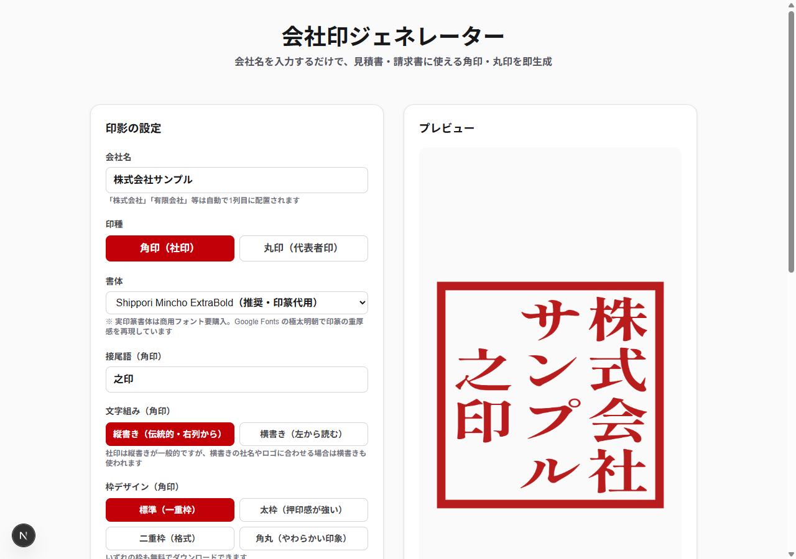

# 会社印ジェネレーター

会社名を入力するだけで、見積書・請求書にそのまま貼れる **角印(社印)** と **丸印(代表者印)** の
印影画像をブラウザ上で生成する Web アプリです。印影の描画は Canvas でクライアント側だけで完結し、
入力した会社名がサーバーに送られることはありません。



| 角印(社印) | 丸印(代表者印) |
|---|---|
|  |  |

## 特徴

- **角印・丸印の2種類**に対応。「株式会社」などの法人格を自動で判別し、角印では独立した1列に配置します
- **4書体**から選択(Google Fonts の極太明朝で印篆の重厚感を再現)。
  実際に描く文字を指定して読み込むため、1つの印影の中で書体が混ざりません
- 文字の大きさは印面全体で1つに揃え、マスの縦横比に応じた長体・平体だけを
  上限つきでかけます(字ごとに引き伸ばさないため、かな・カタカナが崩れません)
- 角印の**縦書き / 横書き**、枠デザイン**4種**に対応(いずれも無料)
- 朱色は自由に変更可能
- **透過 PNG** で書き出すため、既存の書類に重ねて貼れます

## 料金

いま売っているものを1段落で書くと(2026-08-23 時点):印影の生成から透過 PNG(560px)の
ダウンロードまでは**透かしなしで無料**で、無料で作成した印影はそのまま**商用利用もできます**。
有料は「**業務利用パック**」500円(税込・買い切り)の1本だけで、買うと
購入者名・発行番号・購入日の入った**利用許諾書**が書面(テキストファイル)として手元に残り、
あわせて高解像度 PNG(300 / 600 / 1200 / 2000px)の4サイズ一括ダウンロードと
角印・丸印の同時書き出しが付きます。

| | 無料 | 業務利用パック(500円・買い切り) |
|---|---|---|
| 印影の生成・プレビュー | ✓ | ✓ |
| 書体・色の変更 | ✓ | ✓ |
| **透かし** | **入りません** | 入りません |
| **購入証明つき利用許諾書**(発行番号・購入日) | — | **✓** |
| 商用利用 | ✓ | ✓ |
| PNG ダウンロード | 560px | 300 / 600 / 1200 / 2000px |
| 角印・丸印の一括書き出し | — | ✓ |

無料プランの出力に透かしは入れず、商用利用も無料の範囲で認めています。
有料パックとの差は「**購入者名の入った利用許諾書が書面として手元に残るか**」の1点に絞り、
高解像度と一括書き出しは、その書面に付いてくるものと位置づけています
(2026-08-11 に看板を「高解像度パック」から架け替え、2026-08-16 に
「商用利用の許諾」を売り文句から外しました。詳細は `src/lib/pricing.ts` の冒頭コメント)。

## 技術スタック

- [Next.js](https://nextjs.org) 16(App Router / Turbopack)
- React 19 / TypeScript
- Tailwind CSS v4
- Canvas 2D API(印影の描画。外部の画像生成ライブラリは使っていません)
- Stripe Checkout(決済。SDK は入れず REST API を直接呼び出しています)

## セットアップ

```bash
npm install
npm run dev
```

http://localhost:3001 が開きます。決済を伴わない機能はこれだけで動きます。

### 環境変数

決済を動かす場合のみ、`.env.local`(またはホスティング先の環境変数)に次を設定します。

| 変数 | 説明 |
|---|---|
| `STRIPE_SECRET_KEY` | Stripe のシークレットキー。**サーバー側のみで参照**し、クライアントには渡しません |
| `SITE_URL` | 決済完了後の戻り先を組み立てるためのサイト URL(末尾スラッシュなし) |

未設定の場合、決済 API は `500 payment not configured` を返し、無料機能はそのまま動作します。

## 決済の仕組み(ステートレス設計)

データベースを持ちません。購入内容は Stripe の Checkout セッションの `metadata` に載せて往復させます。

```
ブラウザ ──POST /api/checkout──▶ Stripe にセッション作成(metadata に印影の設計値)
        ◀──── Checkout の URL ───
        ──────── 決済 ─────────▶ Stripe
        ◀── /unlock?session_id= ──
        ──GET /api/unlock────────▶ Stripe にセッション照会
                                   payment_status === "paid" のときだけ設計値を返す
        ◀─── 設計値 + 発行番号 ───
        (ブラウザが高解像度で再描画してダウンロード)
```

この構成のため、当方のサーバーには購入者の情報が一切保存されません。

## ディレクトリ

```
src/
├── app/
│   ├── api/checkout/route.ts   Checkout セッションの作成
│   ├── api/unlock/route.ts     決済の検証と設計値の返却
│   ├── legal/page.tsx          特商法表記・プライバシーポリシー
│   ├── unlock/page.tsx         決済後のダウンロード画面
│   └── page.tsx                トップ
├── components/
│   ├── SealGenerator.tsx       設定 UI・プレビュー・購入導線
│   ├── UnlockPanel.tsx         購入済みの高解像度ダウンロード
│   └── SiteFooter.tsx
└── lib/
    ├── seal.ts                 印影の描画ロジック
    ├── sealDesign.ts           設計値の検証と Stripe metadata 変換
    ├── pricing.ts              料金プランの定義
    ├── license.ts              利用許諾書の生成
    ├── download.ts             書き出しヘルパー
    └── site.ts                 事業者表記
```

## ご利用上の注意

本アプリが生成するのは印影の**画像データ**であり、実物の印章ではありません。
**印鑑登録(実印)には使用できません。**
生成された印影が既存の登録商標や他社の印影と類似しないことは保証しません。
